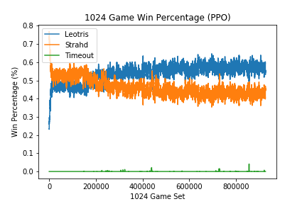

# Dungeons and Dragons RL Bot

Welcome to dungeons and data. This repository contains implementation of the following RL Algorithms:

* Tabular Q-Learning
* Q-Learning (Linear function approximation)
* Deep Q-Learning
* Double Deep Q-Learning
* Dueling Double Deep Q-Learning
* Proximal Policy Optimization

## Dungeons and Dragons Primer:

This section provides a brief overview of Dungeons & Dragons rules and mechanics:

* In D&D, all characters have a certain amount of `hit_points` (health)
* The goal of each agent (i.e character) is to reduce the `hit_points` of all enemies to zero
* The game takes place in rounds in which each character gets a turn within these rounds
* Within a character's turn, they may take the following actions:
    * Attack: Attacks have two distinct steps:
        1. The character rolls a 20 sided `hit_dice` in order to see if they successfully hit their opponent. 
        2. If the roll is above their enemy's `armor_class`, a `damage_dice` is rolled and the amount is subtracted from their enemies total `hit_points` (Depending on the attack, the `damage_dice` can be a 6 sided dice, 12 sided dice, etc.)
        3. Generally, each character may only attack once per turn
    * Move: A character can move up to a certain amount, usually 30 ft, during their turn. 
* Once all characters have finished their turn within a round, all movement and used attacks are refunded to all characters

## Scenario description
### Environment
    * Currently, the agents operate in a [50ft x 50ft room]
#### Characters:
    * Leotris:
        * `hit_points`: 25
        * `armor_class`: 16
        * `shoot_arrow` attack: 
            * 60 ft range
            * `hit_bonus`: +5
            * `damage_dice`: 1d12
            * `damage_bonus`: +3
     * Strahd:
        * `hit_points`: 200
        * `armor_class`: 16
        * `vampire_bite` attack:
            * 5 ft range
            * `hit_bonus`: +10
            * `damage_dice`: 3d12
            * `damage_bonus`: +10

### [Combat Handler](combat_handler.py) (This documentation is a work in progress):

1. Combat is initialized
    * Initiative is rolled
    * Health is set to full (subject to change in the future)
    * Last "known states" are initialized
2. A round of combat is executed
    1. A `creature` is selected based off of it's rolled initiative
    2. While an "`EndTurn`" action has not been sampled from the selected creature:
        1. The `current_state` of the creature is observed and saved to be used later for learning
        2. The `creature` is prompted to select an `action` based off of it's strategy (ex: [PPO]())
        3. The chosen `action` is saved to be later used for learning
        3. The selected `action` is used
        4. The resulting state is observed (`next_state`) and saved for later learning
        5. A `reward` value is determined and saved for later learning
    3. Return to step 2.1 untill all `creature`s have had a turn
3. Once a round has finished execution, all characters [update their strategies]() from saved `states`, `actions`, and `rewards`
4. If combat is not over, return to step 2
5. Once combat is over and a winner is determined, allow all creatures to updated based off of the entire combat sequence (trajectory that has reached a terminal state)
6. Repeat from step 1 `N` number of times

### Results:
#### Random Actions:
* Both agents taking random actions, this is the win % of `Leotris`

#### PPO:
* The figure below shows the win % in the case where `Strahd` takes random actions and `Leotris` follows a proximal policy optimization strategy.

